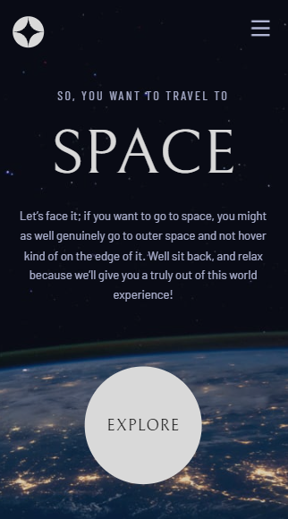
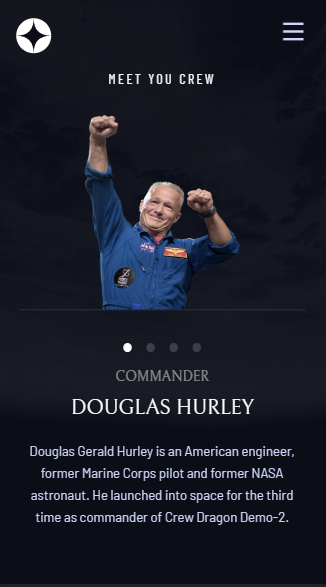
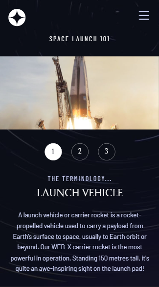
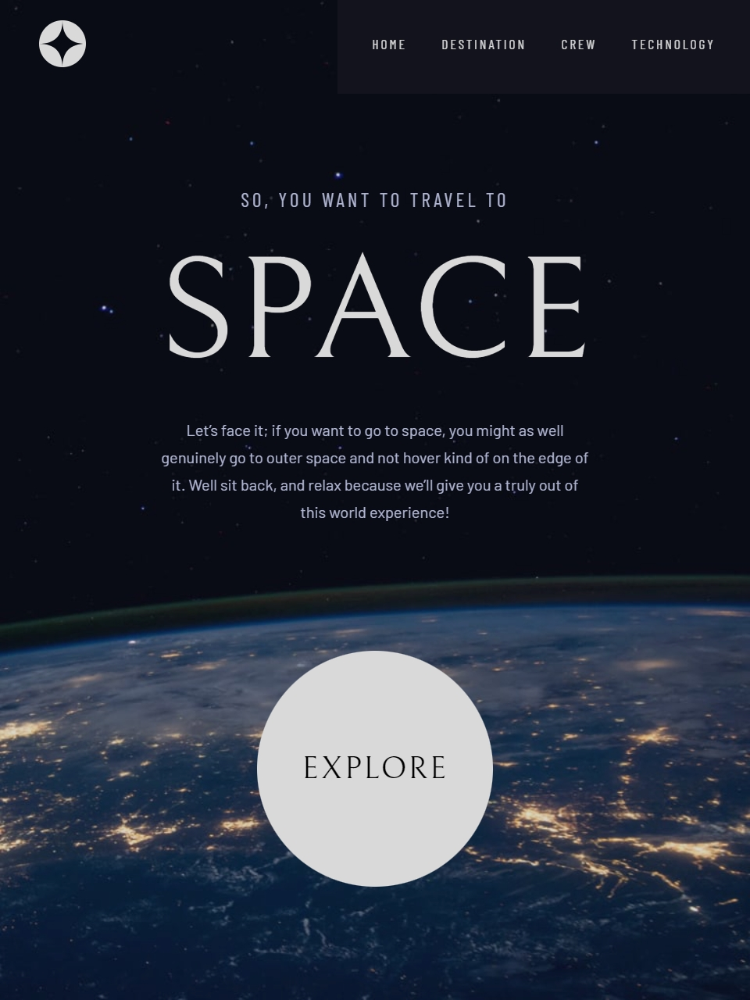
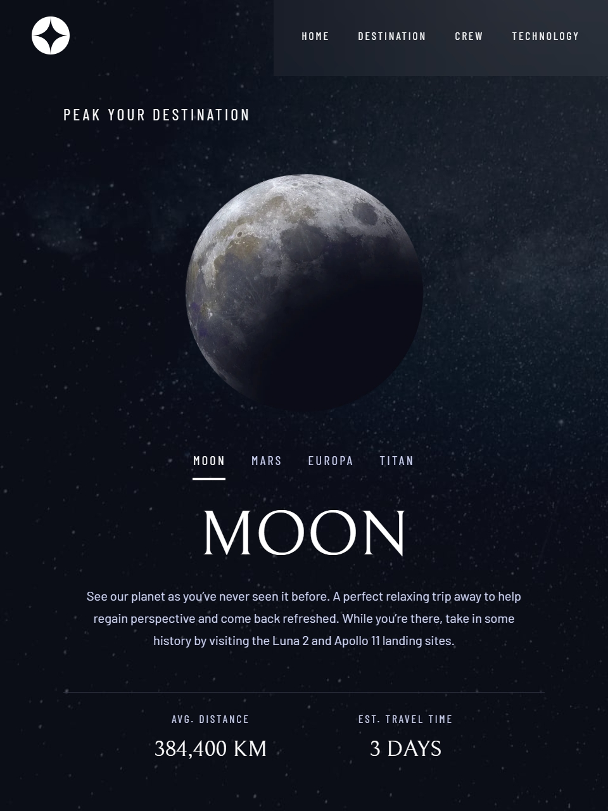
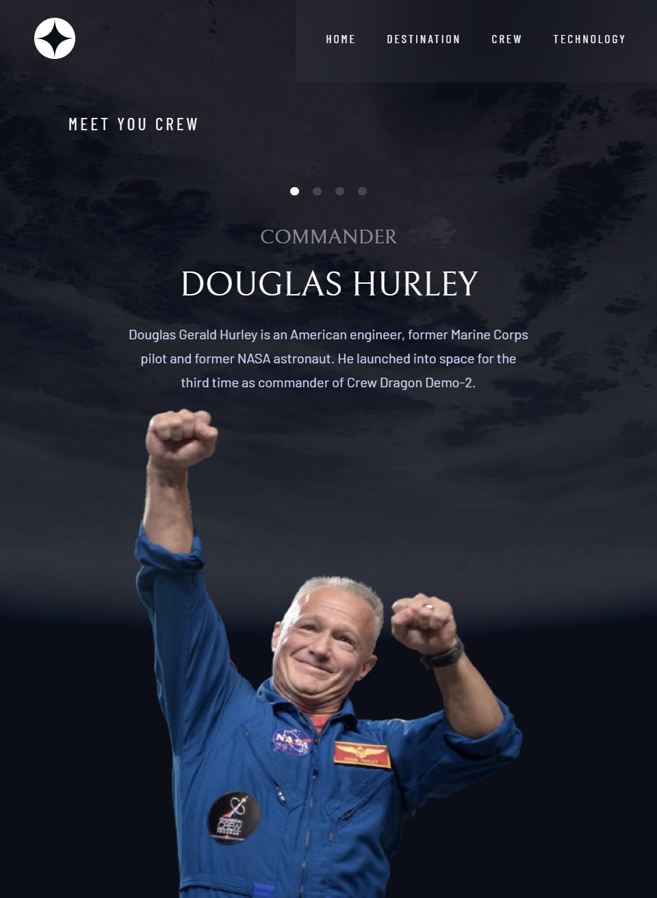
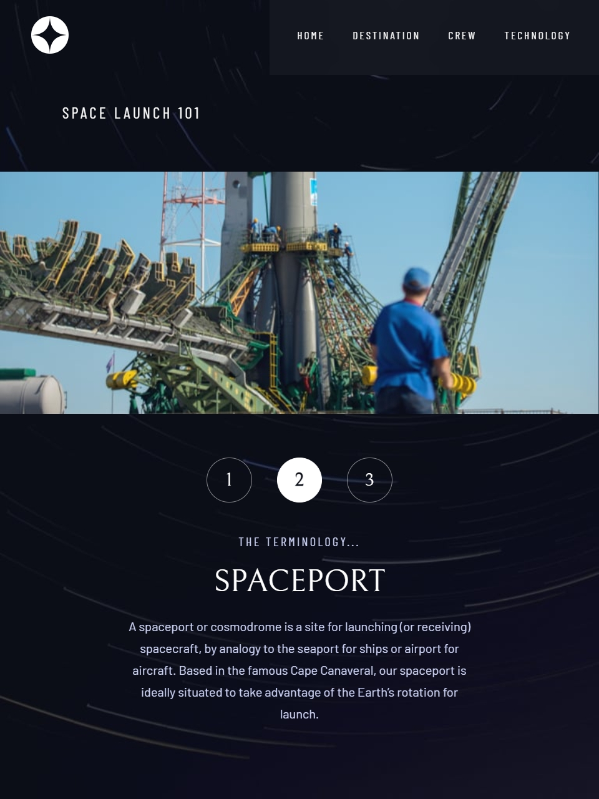

# Frontend Mentor - Space tourism website solution

This is a solution to the [Space tourism website challenge on Frontend Mentor](https://www.frontendmentor.io/challenges/space-tourism-multipage-website-gRWj1URZ3). Frontend Mentor challenges help you improve your coding skills by building realistic projects. 

## Table of contents

- [Overview](#overview)
  - [Screenshot](#screenshot)
  - [Links](#links)
- [My process](#my-process)
  - [Built with](#built-with)
- [Author](#author)

## Overview
### Screenshot

### Links

- Solution URL: https://github.com/Zig94/Space-website
- Live Site URL: https://zig94.github.io/Space-website/

## My process

### Built with

- Semantic HTML5 markup
- CSS custom properties
- Flexbox
- Mobile-first workflow
- SASS && BEM

## Author
- Frontend Mentor - [@Zig94](https://www.frontendmentor.io/profile/Zig94)
- GitHub          - [@Zig94](https://github.com/Zig94)

